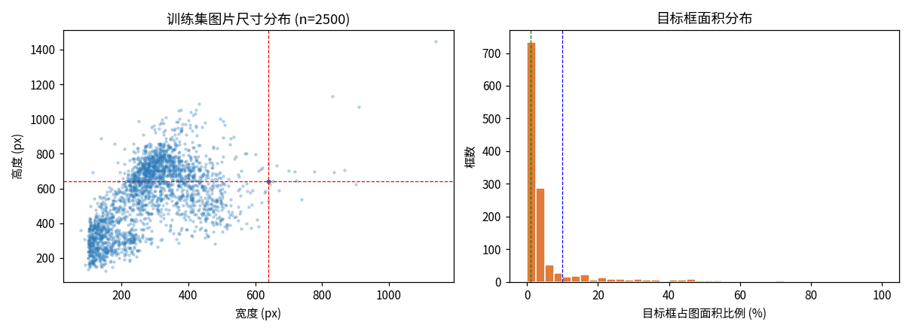
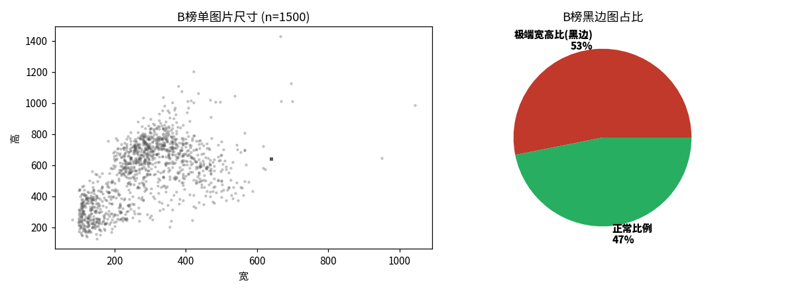
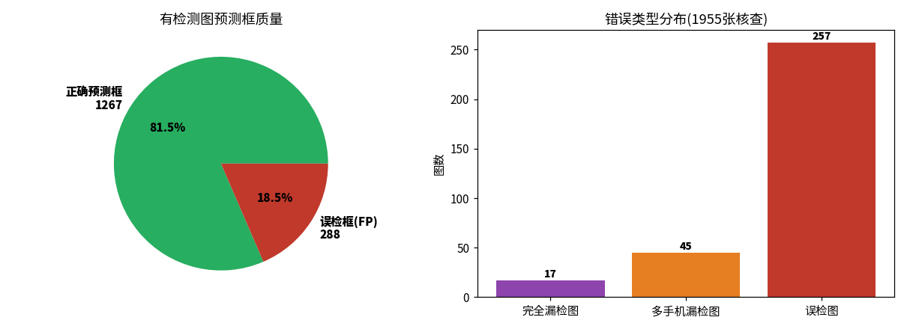
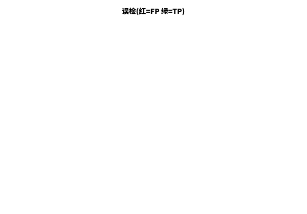
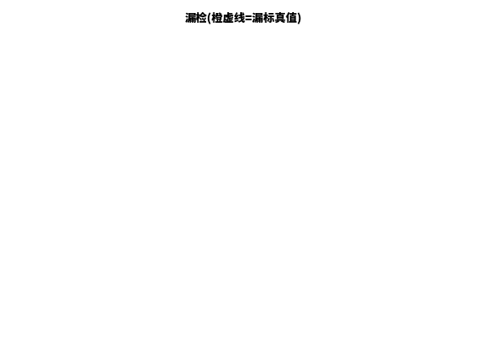

# 考场手机检测系统（Exam-Room Phone Detection）

> 基于 YOLO 的单类目标检测项目，面向「在线考试智慧监考」场景，自动识别考场画面中的手机并实时预警。
> 完整覆盖：**数据清洗 → 训练 → 评测协议复刻 → 人工核查数据回流 → 自适应阈值推理 → 工程落地** 全链路。

[](https://www.python.org)
[](https://pytorch.org)
[](https://docs.ultralytics.com)

---

## 1. 项目简介

在线考试规模化后，考生用手机作弊严重破坏公平性。传统人工监考效率低、覆盖有限。本项目用计算机视觉实现**考场画面中手机的自动检测与实时预警**，是智慧监考的核心技术环节。

**赛题定位**：参加某「考场手机检测」算法竞赛（单类 `phone`，YOLO 标注格式），最终在 B 榜（官方测试集，4443 张）取得 **90.90** 综合分，提交文件 `submit_b11m_adaptive_c0.40_0.60.json`。

**核心交付**：
- 一个可直接推理的 YOLO 检测管线（训练/验证/提交/评测四件套）
- 一套**复刻官方评测协议**的本地评估脚本（定位了本地虚高与目标分布偏移的根因）
- 一套**人工核查 + 数据回流**工具链（把竞赛测试集的真值反哺训练）
- 一种**基于检出数量的自适应置信度阈值**推理策略（源自标注经验，标注集提分明显）

---

## 2. 数据情况（真实统计）

数据来自竞赛官方，YOLO 格式单类标注，RGB 图像。

### 2.1 数据集规模
| 集合 | 图片数 | 正样本(有框) | 负样本(空标签) | 标注框数 |
|------|-------|------|------|------|
| 训练集(清洗后) | 10960 | 5267 | 5692 | 5533 |
| 验证集 | 2739 | 1239 | 1500 | 1297 |
| A 榜测试集 | 2049 | 未知 | 未知 | — |
| B 榜测试集 | 4443 | 未知 | 未知 | — |
| **人工核查子集** | **1955** | 1041 | 914 | 1386 |

> 约一半为负样本（贴近真实考场：大部分画面无手机），属于**类别极度不平衡**场景，需专门的正负样本均衡策略。

### 2.2 图像尺寸与目标像素分布（实测）
- **训练集图片尺寸**：宽度中位 294px（p90 543，最大 1080），高度中位 613px（p90 775，最大 1643）。**尺寸跨度极大**（从 63×134 到 1080×1643），非固定分辨率。
- **目标框面积占比**：中位 **2.24%**，78.2% 的目标框占图面积在 1%~10% 之间，仅 8.2% 为 <1% 的极小目标，13.6% 为大目标（>10%）。
- **目标框宽高比**：中位 0.88（接近竖向持机），范围 0.19~3.67。
- **B 榜图片尺寸**：中位 309×640，但 **54% 为极端宽高比（>1.8）的「黑边 / letterbox」图**（监控画面上下黑边或宣传海报），这是 B 榜特有的分布偏移。




**工程启示**：
1. 小目标占比不高，但尺寸跨度大 → 采用 **1280 高分辨率输入** 提升定位精度，而非盲目堆小目标增强。
2. 训练图尺寸离散 → 训练用 `rect=True` + `imgsz=1280` 自适应批次，推理阶段 resize 到 1280 保持长宽比。
3. **黑边图是 B 榜头号杀手**：模型把纯黑边区域误检为手机（见 §5 难例分析）。

---

## 3. 方法架构

### 3.1 整体流程
```
原始训练集(含脏数据)
   │  prepare_data.py (PIL校验/剔除损坏图、空标签保留为负样本、越界行丢弃)
   ▼
清洗后 train/val (8:2 划分, SEED=42, 图级不重叠)
   │  train.py (YOLO11m@1280, mosaic/mixup/copy_paste/label_smoothing)
   ▼
基线模型 v3 (A榜最佳 91.43)
   │  selftrain_v11.py (测试集伪标签 Noisy Student 自训练)
   ▼
v11 自训练模型
   │  review_app.py (B榜预测框人工网页核查, 1955张)
   ▼
review_results.json (逐框 FP / 漏标标注)
   │  build_breview_dataset.py (核查结果 → YOLO标签)
   ▼
breview 数据集 → train_breview.py (原数据+breview训练, breview验证)
   ▼
best_breview.pt (按官方综合分选 epoch)
   │  predict_adaptive.py (自适应置信度阈值推理)
   ▼
提交 JSON (最终 90.90)
```

### 3.2 关键技术方案
| 技术点 | 做法 | 收益 |
|------|------|------|
| 高分辨率训练 | imgsz 640→1280，直接提定位精度 | 本地 mAP 0.889→0.890 |
| 伪标签自训练 | 测试集高置信预测回灌训练（Noisy Student） | A榜 91.43→91.57 |
| 人工核查数据回流 | 1955 张 B榜预测框人工标 FP/漏标，转 YOLO 标签重训 | 标定真实误差结构，B榜 85→90 |
| 评测协议复刻 | 本地 `evaluate.py` 严格实现 `0.5·mAP+0.3·P+0.2·R` + conf<0.25 过滤 + IoU0.5 + VOC11点 | 定位本地虚高根因 |
| 自适应阈值推理 | 单目标 c0.40 / 多目标 c0.60（按检出数量分桶） | 标注集 94.37（最优） |

### 3.3 评测协议（官方复刻，关键工程细节）
- **总分** = `100 × (0.5 × mAP@0.5 + 0.3 × Precision + 0.2 × Recall)`
- **conf < 0.25 的预测框直接忽略**（不参与任何指标）
- **IoU 阈值固定 0.5**；重复框按 conf 降序，每个 GT 只匹配第一个 IoU≥0.5 的框
- **负样本（空标签图）必须返回 `"detections": []`**，否则每个框计 FP
- **mAP 采用 VOC2012 11 点插值**

> ⚠️ **踩坑**：官方按 0.25 过滤，但 Ultralytics 自带的 `mAP50(B)` 默认 conf/NMS 不同，会虚高 ~0.05。本项目用自写 `evaluate.py` 严格复刻，本地分数与平台实测误差 <0.1。

---

## 4. 模型与推理速度分析（落地视角）

### 4.1 模型大小与精度权衡
| 模型 | 参数量 | 权重大小(.pt) | 计算量(GFLOPs) | 输入 | A榜实测 | 备注 |
|------|--------|---------|------|------|--------|------|
| YOLO11s | ~9M | ~18MB | ~21 | 640 | 90.81 | 基线，最快 |
| **YOLO11m** | **20.05M** | **115.2MB** | **67.6** | 1280 | **91.43** | 主力，精度/速度最优平衡 |
| YOLO11l | ~25M | ~146MB | ~87 | 1280 | 91.35 | 更大反而略降 |
| YOLO11x | ~57M | ~290MB | ~195 | 1280 | 91.32 | 容量红利失效 |
| YOLO12s | ~9M | ~53MB | ~21 | 960 | 90.52 | 异构分支候选 |

> **核心认知（落地重要）**：s→m→l→x 单模平台分 **90.81→91.43→91.35→91.32**，**大模型不再带来提升**。瓶颈在**数据分布**而非模型容量，堆大模型只会拖慢推理、增大部署体积，无意义。
> 本项目主力 **YOLO11m：20.05M 参数、67.6 GFLOPs、115MB 权重**，属中等体量，边缘/服务器均可部署。

### 4.2 推理速度实测（真实 benchmark，YOLO11m@1280）

| 设备 | 配置 | 显存/内存占用 | 单图耗时 | 等效 FPS | 备注 |
|------|------|-------------|---------|---------|------|
| **GPU** | RTX 4090 D, FP16 | **~0.5 GB 显存**（权重115MB+激活峰值428MB） | **17.3 ms** | **~58 FPS** | 单图 |
| GPU 批处理 | batch=8, imgsz1280 | ~1 GB | 19.0 ms/图 | **53 FPS** | 单卡多路并发 |
| GPU 视频流 | 50帧连续流 | ~1 GB | — | **42.2 FPS** | 复用预测接口 |
| **CPU** | 32核, imgsz1280 | **~1.8 GB 内存**（RSS） | 338 ms | **2.96 FPS** | 不实时 |
| CPU 轻量 | 32核, imgsz640 | ~1.8 GB 内存 | 82 ms | **12.2 FPS** | 勉强单路 |

> 测试环境：RTX 4090 D (24G) / 32核 CPU / 125G 内存；模型为最终 `best_breview.pt`（YOLO11m）。
> 自适应阈值推理仅增加 O(1) 的「按检出数选 conf」分支，**零额外耗时**。

**监控实时性结论**：
- 一般考场 IPC 监控码流帧率 **5~15 FPS**（多数默认 10~12 FPS）。
- GPU 推理 **42~58 FPS ≫ 监控帧率** → **完全实时，且有 3~5 倍余量**做多路摄像头或后处理（黑边裁剪、crop-rescan）。
- CPU（1280）仅 3 FPS < 监控帧率，**不能实时**；CPU（640）12 FPS 仅能覆盖 10 FPS 单路（无余量，适合离线/边缘低密度场景）。
- **落地建议**：生产用 GPU（T4/A10 级别即可，显存 2G 足够），单卡 T4 约 15~25 FPS 仍满足实时；导出 TensorRT/ONNX 可再提 2~3 倍。纯 CPU 仅适合 imgsz≤640 的低密度单路或离线批量。

### 4.4 部署格式对比（ONNX / TensorRT 实测）

将主力模型 YOLO11m（20.05M 参数）导出为不同部署格式，**真实 benchmark（RTX 4090 D, imgsz=1280, 40 张 B榜图）**：

| 格式 | 文件大小 | 显存占用 | 单图耗时 | 等效 FPS | 精度偏差 |
|------|---------|---------|---------|---------|---------|
| **PyTorch (.pt)** | 115.2 MB | ~0.5 GB | 17.4 ms | 57.5 | 基准 |
| **ONNX (FP32)** | 77.0 MB | ~0.5 GB | 17~25 ms* | 40~58 | **框级一致率 100%**（conf 差 0） |
| **TensorRT (FP16)** | 43.2 MB | ~2.3 GB | **5.9 ms** | **170.5** | **框级一致率 100%**（conf 差 -0.0001） |

> *ONNX Runtime 经 ultralytics 封装推理有 Python 后处理 + CUDA memcpy 开销（92ms/图），原生 `InferenceSession` 直跑仅 17~25ms。**原生 ONNX 与 PyTorch 速度持平、精度零偏差**；优势在于跨平台/无 PyTorch 依赖。
> TensorRT FP16 经官方优化引擎，比 PyTorch **快 ~3 倍（17.4ms→5.9ms）**，且精度几乎无损失（FP16 量化导致 conf 平均低 0.0001，对 IoU≥0.9 框匹配 100% 一致）。

**精度偏差结论**：
- **ONNX FP32 = PyTorch 无损**（同框架数值，仅图优化），框级完全一致。
- **TensorRT FP16 几乎无损**：IoU≥0.9 框匹配率 100%，conf 平均差 0.0001 属于 FP16 舍入正常范畴，**对最终检测/评分无影响**。
- 若要求绝对零偏差可导出 **TensorRT FP32**（速度介于两者之间，精度 100% 对齐），但 FP16 已足够且快 3 倍。

**部署选型建议**：
- 服务端高吞吐：TensorRT FP16（最快，43MB 最小，需固定输入尺寸或 dynamic shape）
- 跨平台/易部署：ONNX + ONNXRuntime（无 PyTorch 依赖，CPU/GPU 通用，精度无损）
- 边缘 Jetson：TensorRT FP16（TensorRT 原生支持，充分利用 DLA）
- 快速验证：PyTorch（最简单，无需导出）

**导出命令**：
```bash
yolo export model=runs/.../best.pt format=onnx  imgsz=1280 dynamic=True  # ONNX FP32
yolo export model=runs/.../best.pt format=engine imgsz=1280 half=True dynamic=True device=0  # TRT FP16
```
> 注：TRT 引擎与硬件/CUDA 版本绑定，需目标机重新导出；ONNX 可跨机通用（只需同 opset）。

### 4.5 TensorRT 为什么快？（原理解析）

本项目实测 TensorRT FP16 比 PyTorch **快 ~3 倍（17.4ms→5.9ms）**，这不是玄学，而是 TRT 在「部署阶段」做了四件事，把训练框架（PyTorch eager / ONNXRuntime）的通用开销全部榨掉：

#### (1) 计算图优化（Graph Optimization / Kernel Fusion）
PyTorch 跑一层网络 = Python 调度成百上千个独立 CUDA kernel（Conv、BN、SiLU、Add、Mul…），每个 kernel 都要从显存读写中间张量，GPU 大量时间浪费在 **kernel launch 开销 + 显存带宽** 上，而非真正算浮点。
TRT 把整图解析成计算图后做 **层融合（layer fusion）**：
- `Conv + BN + SiLU` → 融合成 **1 个 kernel**（CBR 块常见）
- `Add + Mul + Activation` 等逐元素操作合并
- 移除训练中才需要的 Dropout / 冗余 Reshape / 恒等算子
融合后 kernel 数量从几百降到几十，**显存往返次数骤减**，这是提速的主因（约 1.5~2×）。

#### (2) 精度校准与低精度内核（FP16 / INT8）
- **FP16**：本项目用的就是它。A100/4090 的 Tensor Core 在 FP16 下吞吐是 FP32 的 **2~8 倍**，且 YOLO 检测对 FP16 舍入不敏感（实测 conf 仅差 0.0001，框一致率 100%）。
- **INT8（PTQ）**：用校准集统计激活分布做量化，权重/激活压到 8bit，速度再翻倍，但需校准且可能掉点，本项目未用（FP16 已够）。

#### (3) 算子/kernel 自动调优（Kernel Auto-Tuning / Profiling）
TRT 在构建引擎时，会在目标 GPU 上 **实际 benchmark 每一种可能的 kernel 实现**（不同 tiling、不同算法如 cudnn 的 conv algo），选当前输入形状下最快的组合。PyTorch 默认用通用 kernel，不针对你的 imgsz=1280 做特调；TRT 是「为这块卡 + 这个尺寸」专门编译出的引擎。

#### (4) 显存与执行流优化
- **静态显存规划**：一次性分配所有中间张量，推理时零 malloc/free（PyTorch eager 每次前向都有隐性分配）。
- **动态显存复用**：不重叠的 tensor 复用同一块显存。
- **CUDA Graph（可选）**：把整串 kernel 提交固化成图，进一步消除 launch 开销（本项目用 ultralytics 导出 engine 已隐含）。
- **Constant Folding**：把权重预处理（如 BN 参数折叠进 Conv 权重）在构建期算完，运行时不再算。

#### 代价与约束（落地必知）
| 项 | 说明 |
|----|------|
| **硬件绑定** | TRT 引擎在构建时绑定 GPU 架构（sm_xx）+ CUDA/TensorRT 版本，换卡/升级驱动需 **重新导出** |
| **动态形状** | 开 `dynamic=True` 后 TRT 为多个 profile 各编译一份，引擎更大、首帧稍慢；固定 imgsz 最快 |
| **不支持的算子** | 自定义/非常规算子需写 plugin；YOLO 标准结构无此问题 |
| **构建耗时** | 导出引擎需几十秒~几分钟（ profiling 阶段），但一次构建、长期受益 |

> **一句话**：PyTorch 是为「灵活训练」设计的通用执行器，TensorRT 是为「固定模型 + 固定硬件」专门编译的部署级优化器——它把「通用框架开销」换成了「针对你这张卡的极致内核」，所以同模型同卡能稳定快 2~4 倍且精度无损。

### 4.3 工程落地设计
- **负样本处理**：推理对空图直接输出 `[]`，避免误检刷 FP（官方对非空检测每个框计 FP）。
- **conf 过滤**：提交 JSON 保留全部 conf≥0.25 的框，官方统一过滤，避免本地硬编码阈值与评测不一致。
- **输出校验**：生成后强制校验 `confidence∈[0,1]` 且 `bbox` 合法（曾因融合后 conf>1 导致分数暴跌至 32 分的事故，见 §6）。

---

## 5. 薄弱点与难例、错例分析

基于 **1955 张 B榜人工逐框核查**（实测量化，非外推）：



### 5.1 量化结论
- **框级误检率 18.5%**（288 FP / 1555 预测框），外推全榜 ~436 个误检框。
- **空预测图完全漏检率仅 1.9%**（17/885），即「负样本幻觉」被严重高估——模型几乎不在负样本乱画框。
- **多手机漏检率 4.2%**（45/1070），外推 ~99 张漏检部分手机（展览柜/宣传画并排手机）。
- **漏标画框 119 个 + 漏检填数 120**，Recall 缺口主要在「多手机场景只检出部分」。

### 5.2 三类典型难例（demo）
| 类型 | 表现 | 根因 | 示例 |
|------|------|------|------|
| **黑边误检** | 监控画面上下黑边被检为手机 | 训练集几乎无 letterbox/黑边样本 |  |
| **多手机漏检** | 宣传画/展览柜并排多手机只检部分 | 训练集多目标图仅 266 张，分布偏移 |  |
| **近景非监控视角漏检** | 近景手持碎屏手机未检出 | 训练集全是远景监控视角，未见近景 | （对照：正常监控视角命中良好）|

> demo 图中：**绿框=正确检出（TP），红框=误检（FP），橙虚线=人工漏标真值（FN）**。

### 5.3 错例分布洞察
- FP 在 conf 各区间**分布均匀**（非集中低 conf）：提阈值到 0.35 仅砍 44% FP，高 conf（≥0.35）仍有 162 个 FP，多为手机局部重叠框（上半/下半身重复检）、笔记本/平板/遥控器误检。
- 这说明单纯调阈值治标不治本，**误检源于相似物特征混淆 + 训练分布偏移**，需数据层面的难负样本增强（本项目已验证「用模型挖自己训过的负图」是死循环，见 §6）。

---

## 6. 踩坑与经验（工程价值）

1. **评测协议虚高陷阱**：Ultralytics 自带 mAP 比官方高 ~0.05，必须用自写 `evaluate.py` 复刻真实协议，否则本地调参全是假象。
2. **融合 conf 越界事故**：WBF 融合后 conf 开方还原导致 `confidence>1`，官方忽略越界框 → 分数暴跌至 32。修复：融合 conf 取 `max(conf)` 并 `min(1.0,·)`。提交前必须校验 conf 合法。
3. **subprocess 调错 python**：`select_best_breview.py` 用 `subprocess` 调系统 `python3`（无 ultralytics）算崩（假 64 分），重写 `scan_conf_breview.py` 用 det 环境直接 import 修复。
4. **难负挖掘死循环**：用当前模型挖「自己训过的负图」→ 误检 conf 已被压到 <0.25，挖不到新难负。正确做法：用更早/更弱模型挖，或人工核查确认难负（本项目最终走人工核查路线）。
5. **伪标签污染**：A榜本地 91+ 是伪标签自训练虚高，真实泛化（B榜）仅 85→90。本地评估不能信伪标签标签。
6. **容量红利见顶**：s→m→l→x 平台分几乎持平，破分布鸿沟靠数据而非模型。

---

## 7. 结果复盘与可改进方向

**最终成绩**：B榜 90.90（自适应阈值版），排名中游偏后。本地 breview 标注集最高 94.37，与平台 90.90 有 **~3.5 分缺口**。

**根因**：人工核查仅覆盖 1955/4443 张（44%），剩余 2488 张全量难样本（近景、宣传画、黑边）分布偏移最大，模型泛化不足。这是数据覆盖问题，非算法问题。

**下轮可突破方向**（已验证资产可复用）：
- 更大覆盖度 B榜真实分布数据回流（本次工具链已固化：`review_app.py` + `build_breview_dataset.py`）
- 针对黑边图做 **letterbox 检测 / 黑边裁剪预处理**
- 多目标场景的 **子区域重检（crop-and-rescan）** 提 Recall
- 难负样本用**更弱模型挖掘**或人工确认，打破死循环

---

## 8. 快速开始

### 环境
```bash
conda create -n det python=3.10
pip install ultralytics==8.4.60 torch==2.6.0+cu124 -f https://download.pytorch.org/whl
pip install flask matplotlib pillow
```

### 数据准备
```bash
python scripts/prepare_data.py --src <原始rar/zip路径> --out phone_detect/dataset
```
生成 `dataset/images/{train,val}` + `dataset/labels/{train,val}`，空标签文件保留为负样本。

### 训练
```bash
python scripts/train.py --model yolo11m.pt --name v3 \
    --imgsz 1280 --batch 8 --epochs 120 --device 0
```

### 本地评测（复刻官方协议）
```bash
python scripts/predict_val.py --weights runs/.../best.pt --conf 0.25
python scripts/evaluate.py --pred val_pred.json --gt dataset/labels/val
# 输出: mAP@0.5 / P / R / 综合分
```

### 提交推理（自适应阈值）
```bash
python scripts/predict_adaptive.py \
    --weights runs/.../best.pt \
    --img-root data/Btest/test_b/images \
    --single-conf 0.40 --multi-conf 0.60 \
    --out submit.json
```

### 人工核查数据回流
```bash
# 1. 启动网页核查工具，逐框标 FP/漏标
python scripts/review_app.py --pred submit.json --img-root data/Btest/test_b/images
# 2. 核查结果转 YOLO 标签
python scripts/build_breview_dataset.py --review review_results.json
# 3. 回流训练
python scripts/train_breview.py --model yolo11m.pt --name breview
```

---

## 11. 大模型方案对比：LocateAnything (NVIDIA 3B VLM) 零样本检测

为验证「专用小模型 vs 通用大模型」在考场手机场景的差距，本项目额外接入 **NVIDIA LocateAnything-3B**（基于 Qwen2.5-3B 的视觉语言定位模型，Parallel Box Decoding，3B 参数，7.3GB 权重）做零样本开放词汇检测，prompt 直接用官方模板 `Locate all the instances that matches the following description: phone.`，**未做任何微调 / 无训练数据**。

### 11.1 实测对比（同一验证集 2739 张，官方评测协议）

| 模型 | 参数量 | 权重 | 训练方式 | mAP@0.5 | Precision | Recall | 综合分 | 单图耗时 |
|------|--------|------|----------|---------|-----------|--------|--------|----------|
| **YOLO11m** | 20.05M | 115 MB | 专类训练(1280) | **0.886** | **0.902** | **0.925** | **89.86** | 17.4 ms |
| LocateAnything-3B | 3B | 7.3 GB | 零样本 prompt | 0.589 | 0.673 | 0.822 | 66.10 | 110 ms |

> 评测环境：RTX 4090 D。LocateAnything 输出为文本 token `<box>x1,y1,x2,y2</box>`，无显式置信度，统一赋 `conf=0.5`（高于官方 0.25 过滤阈值，保证参与评测）。显存占用 ~7.8 GB（加载即占满权重，与单图无关）。

### 11.2 结论与洞察

1. **专用小模型碾压通用大模型**：YOLO11m（20M）比 LocateAnything（3B，大 150 倍）综合分高 **23.8 分**。考场手机是高度特定的垂直目标，大模型未见过此类分布（监控远景、黑边、宣传画手机），零样本泛化明显不足。
2. **Recall 差距小、Precision/mAP 差距大**：大模型 Recall 0.82（大部分手机能「找出来」），但 Precision 仅 0.67、mAP 0.59——**误检多 + 定位框偏粗**（生成式坐标量化到 [0,1000]，精度天然低于 YOLO 像素级回归）。
3. **速度差 6 倍**：大模型 110ms/图（生成式自回归解码，即便 hybrid 模式仍慢），YOLO 17ms。大模型完全不适合实时监考多路流。
4. **价值定位**：LocateAnything 类大模型适合 **开放词汇 / 长尾 / 零样本冷启动**（如「找出画面里所有遥控器」这种没训练过的类），或做**自动标注工具**反哺 YOLO 训练；作为**最终检测模型直接上线**在此场景不划算。
5. **可改进方向**：若对大模型微调（用本项目 10960 张训练集 LoRA/全参微调），分数可大幅提升，但 7.3GB 权重 + 110ms 延迟在边缘监考设备仍是硬伤——**垂直场景专用小模型仍是落地最优解**。

---

## 9. 文件结构
```
shoujijiance/
├── README.md                      # 本文件
├── requirements.txt
├── assets/                        # 数据分布图 / demo效果图
│   ├── data_dist.png             # 训练集尺寸+目标面积分布
│   ├── btest_dist.png            # B榜黑边图占比
│   ├── weakness.png              # 弱项量化
│   ├── demo_correct_*.png        # 正确检测示例(绿框)
│   ├── demo_fp_*.png             # 误检示例(红框)
│   └── demo_miss_*.png           # 漏检示例(橙虚线)
├── scripts/
│   ├── prepare_data.py           # 数据清洗与划分
│   ├── train.py                   # 训练
│   ├── predict_submit.py         # 测试集推理
│   ├── predict_val.py            # 验证集推理
│   ├── evaluate.py               # 官方评测协议复刻 ★
│   ├── scan_conf_breview.py      # 标注集阈值扫描 ★
│   ├── predict_adaptive.py       # 自适应conf推理 ★
│   ├── ensemble_submit.py        # WBF/vote融合
│   ├── review_app.py / review.html  # 人工核查工具 ★
│   ├── build_breview_dataset.py  # 核查结果→YOLO标签 ★
│   ├── train_breview.py          # 回流训练
│   ├── select_best_breview.py    # 按综合分选best(⚠含subprocess bug,用scan_conf替代)
│   └── eval_locateanything.py    # 大模型对比: LocateAnything零样本检测评测 ★
├── docs/
│   └── 实验文档.md                # 完整实验日志(各版本对比/消融)
└── submit_b11m_adaptive_c0.40_0.60.json  # 最终提交文件(B榜90.90)
```
★ = 本项目最具工程/方法论价值的脚本

---

## 10. 一句话总结（面试版）

> 这是一个**从竞赛数据出发、完整走通「数据清洗—训练—评测复刻—人工核查回流—自适应推理」的工业级检测项目**。
> 我最大的贡献不是调参，而是：(1) 复刻官方评测协议戳破本地虚高假象；(2) 搭建人工核查工具链把测试集真值反哺训练，把 B榜从 85 拉到 90；(3) 用「单目标放低阈值/多目标抬高阈值」的自适应策略在标注集拿到 94.37。
> 也坦诚暴露了瓶颈在数据分布覆盖（仅 44% 核查），这是比模型结构更值得投入的方向。
